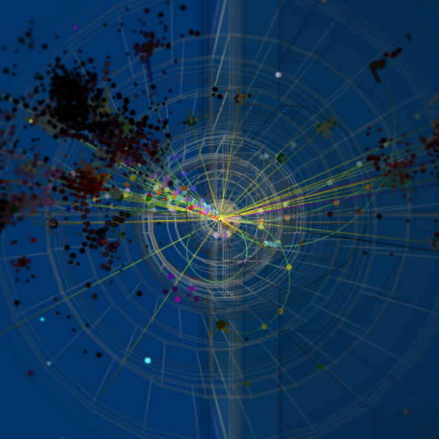

<!-- 
<div class="flex px-4 py-2 mb-8 text-base rounded-md bg-primary-100 dark:bg-primary-900">
  <span class="flex items-center ltr:pr-3 rtl:pl-3 text-primary-400">
    
  </span>
  <span class="flex items-center justify-between grow dark:text-neutral-300">
    <span class="prose dark:prose-invert">This page is a proposal for an updated website and is very much still under construction! If you've somehow ended up here, please see <a href="uslua.org">uslua.org</a> for more information.</span>
  </span>
</div>
 -->

<!-- ```node
npx blowfish-tools
```   -->

<!--  -->


## Why a muon collider? 

**A muon collider is the only near-future technology to allow exploration of the 10 TeV scale and beyond.**

Exploration of the energy frontier has led to some of the most fundamental discoveries of the last century. To continue this exploration into the future, a paradigm shift is needed. We cannot simply build larger and larger versions of the same ee and pp machines: constraints from cost, available land, and energy efficiency put a cap on the reach of these machines. 

A muon collider is an affordable, compact, and energy efficient solution that provides the potential to explore energies well beyond the 10 TeV scale. But to realize this vision in the future, research and development is needed today. 

## Why now? 

**Recent breakthroughs and the need for a global collider future make now the right time to act.**

Over the last decade, major developments in target technology, high field magnets, ionization cooling and precision timing detectors have turned a muon collider from a far-off dream to a tangible possibility. However, realization of such a collider still requires significant international R&D and demonstrator program stretching over the next 2 decades.

Current estimates for the duration of the required R&D program aim for technical readiness to construct the machine in approximately 20 years, making a muon collider the fastest path to energies beyond the LHC. However adequate funding is necessary to maintain this plan and prevent loss in expertise and personnel. With dedicated R&D today, we can re-invigorate the US accelerator program, and inspire particle physicists for decades to come.

Piggybacking off of planned upgrades for Fermilab's proton complex, there is an opportunity to build a Fermilab-sited muon collider, bringing the energy frontier back to US soil.

## What's next?

|||
|-|:-|
|  | **Accelerator R&D** <br> Recent progress in overcoming technical challenges posed by the muon's lifetime has generated a great deal of excitement for particle physicists.|
|  | **Reconstruction Software** <br> Great progress has been made towards identifying signals and reject muon beam-induced background, but there's still much more to do. Check out software packages here, and join the meetings hosted by IMCC. |
| | **Detector R&D** <br> Muon colliders provide unprecedented physics reach, superimposed on a challenging beam-induced background. Precision timing, small feature size, and on-chip intelligence are all required to take advantage of these collisions |
|  | **The IMCC** <br> The International Muon Collider Collaboration (IMCC) is hosted by CERN and securing resources to complete a Muon Collider Design Study before the next European Strategy Report.|


<table>
<tr>
<td></td>
<td>**Accelerator R&D**</td>
</tr>
<tr>
<td></td>
<td>**Accelerator R&D**</td>
</tr>
<tr>
<td></td>
<td>**Accelerator R&D**</td>
</tr>
</table>