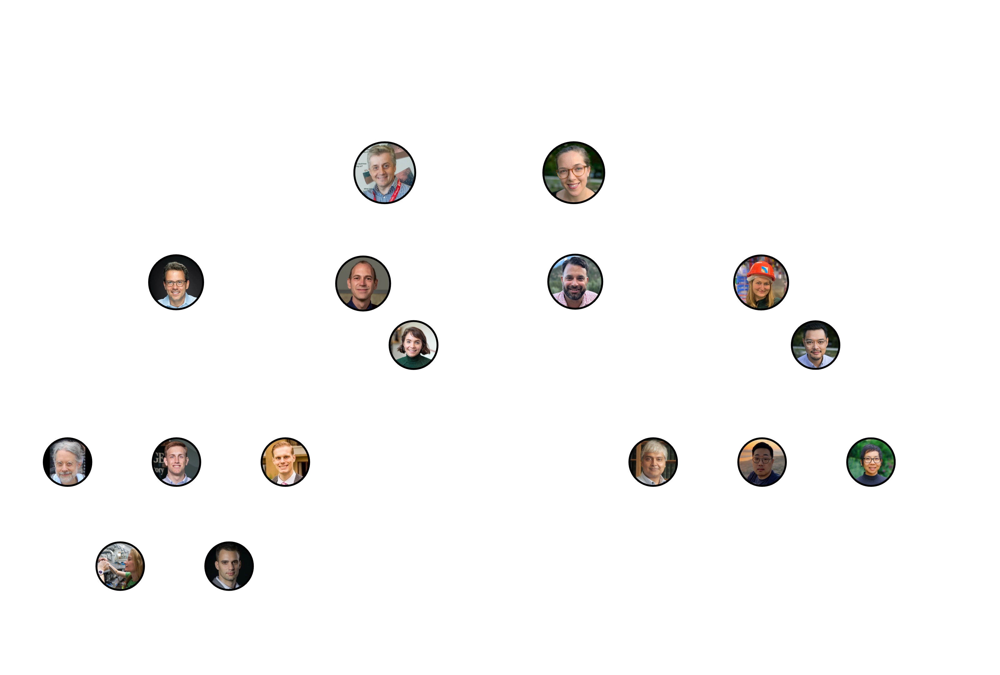

## USMCC Leadership
<!-- 

  

 -->

[Download PDF](251113_USMCCOrgChart.pdf)

Send us an [email](mailto:usmcc-coord@fnal.gov) for more information about the muon collider effort or to get involved. See also our [people](/people) page for list of USMCC members.

In addition to the elected leadership, the Leadership Strategy Group was appointed to help steer the direction of the organization. It includes:

Pushpa Bhat (FNAL), Marcela Carena (Perimeter Institute), Sarah Cousineau (ORNL), Nathaniel Craig (UCSB), Sridhara Dasu (UW), Peter Elmer (Princeton), Cameron Geddes (LBNL), Maurice Garcia Sciveres (LBNL), Andre de Gouvea (NW), Tao Han (Pittsburgh), Isobel Ojalvo (Princeton), Mark Palmer (BNL), Chris Quigg (FNAL), Kate Scholberg (Duke), John Seeman (SLAC), Vladimir Shiltsev (NIU), Jinlong Zhang (ANL), Bob Zwaska (FNAL)

You can find an archive of past leadership [here](/contact/leadership_archive/).

## Muon Collider Speakers

For requests for a muon collider speaker at a conference, please reach out to our [Speakers Committee](mailto:usmcc-speakers@fnal.gov) (chair: Kevin Black). 

If you're interested in inviting a colloquium speaker to your institute, here's a list of US-based speakers you could consider reaching out to:
* Sergo Jindariani (Fermilab)
* Nathaniel Craig (UCSB)
* Tova Holmes (Tennessee)
* Patrick Meade (Stony Brook)
* Karri DiPetrillo (Chicago)
* Isobel Ojalvo (Princeton)
* Kevin Black (Wisconsin)
* Lawrence Lee (Tennessee)
* Tao Han (Pittsburgh)
* Cari Cesarotti (CERN)

If you'd like to be on this list but aren't, send us an [email](mailto:usmcc-coord@fnal.gov)!
