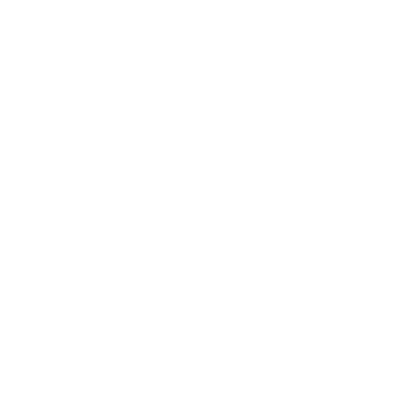
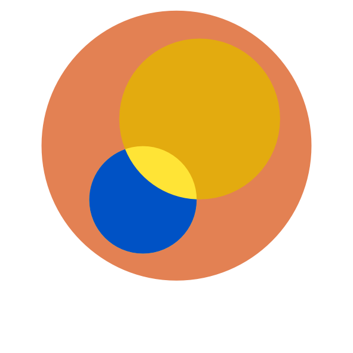
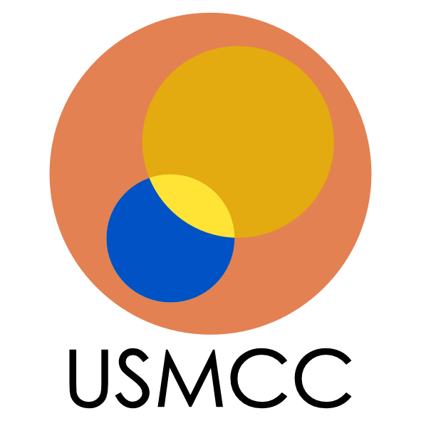

## Learn More

[Sketching out a muon collider](https://cerncourier.com/a/sketching-out-a-muon-collider/) - CERN Courier

[Muons cooled for action](https://cerncourier.com/a/muons-cooled-for-action/) - CERN Courier

[IMCC](https://muoncollider.web.cern.ch/) - International Muon Collider Collaboration 

[MuCol](https://mucol.web.cern.ch/) - European Design Study 

[Common misconceptions](/misconceptions) - The facts around some frequently heard objections to muon colliders

## Overview Videos

[Nathaniel Craig @ Princeton](https://phy.princeton.edu/events/hamilton-colloquium-series-nathaniel-craig-univ-casanta-barbara-“who-ordered-”-collider-feb)

[Nima Arkani-Hamed @ UCSB](https://www.youtube.com/watch?v=wKPwzezceGo)

[Tova Holmes @ Stanford](https://www.youtube.com/watch?v=U0mkeqfXbls)

[Mark Palmer @ SLAC](https://stanford.zoom.us/rec/play/Ct6wMUaUPUadLWj49M-q7kAoCu2OV_9lZRfQ-CpB97MR0WqfacP-6wioOuB48QXJsCAXrApNTxkZ_uvp.DWZ5SXzo2N-B7i79)

[Patrick Meade @ Toronto](https://youtu.be/6o_p27vAykU?si=Y5OrobqqcLyQ3pBX)

[Karri DiPetrillo @ Sydney CPPC](https://www.youtube.com/watch?v=4bnTRqXPQPI)

## Overview Papers

[Input from IMCC to the European Strategy Process](https://indico.cern.ch/event/1439855/contributions/6461618/)

[Interim report for the International Muon Collider Collaboration](https://arxiv.org/abs/2407.12450)

[Towards a Muon Collider](https://arxiv.org/abs/2303.08533) - EPJC

[Muon Collider Forum Report](https://arxiv.org/abs/2209.01318) - Snowmass Whitepaper

[Future Collider Implementation Task Force Report](https://arxiv.org/abs/2208.06030) - Snowmass Whitepaper

## Software

[Detector Simulation Tutorial](https://mcd-wiki.web.cern.ch/software/tutorials/fermilab2024/)

[Muon Collider Detector and Physics Wiki](https://mcd-wiki.web.cern.ch/)

## Letters to P5 and NAS

[Muon Collider R&D](https://docs.google.com/document/d/1mLi47T9df4utHfX4aN69H25KrYhJzkhPkiSqGBJoGZE) - Letter to NAS EPP2024

[Muon Collider R&D](https://sites.google.com/view/ec-for-mc/home) - Letter to P5

[Accelerator R&D](https://sites.google.com/view/ec-for-future-colliders/home) - Letter to P5, joint with C3

## USMCC Documents

[Charter](https://drive.google.com/file/d/1y5Z5OHoUTwrPT8yMk7YV4Ch98EswjqoJ/view?usp=share_link)

[Input to European Strategy](https://indico.cern.ch/event/1439855/contributions/6461576/attachments/3076691/5443733/152-Update-ESPPU_USMCC_draft_v8.pdf)

## Official USMCC logos


    
    
    
    


